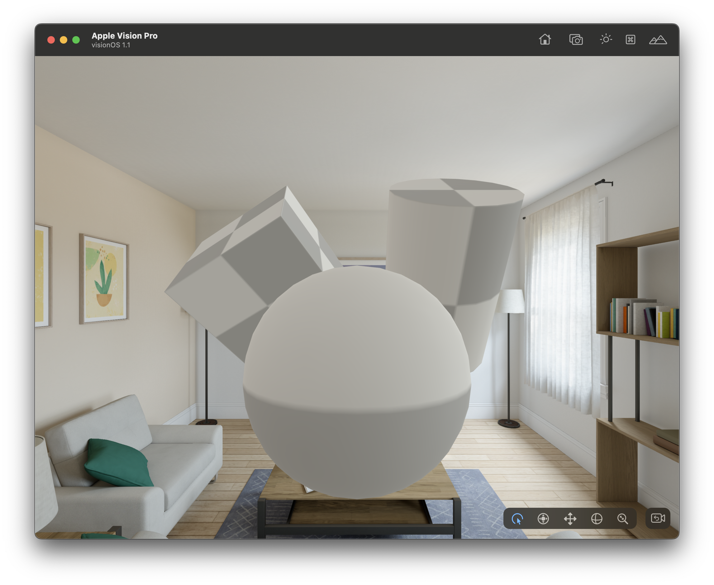
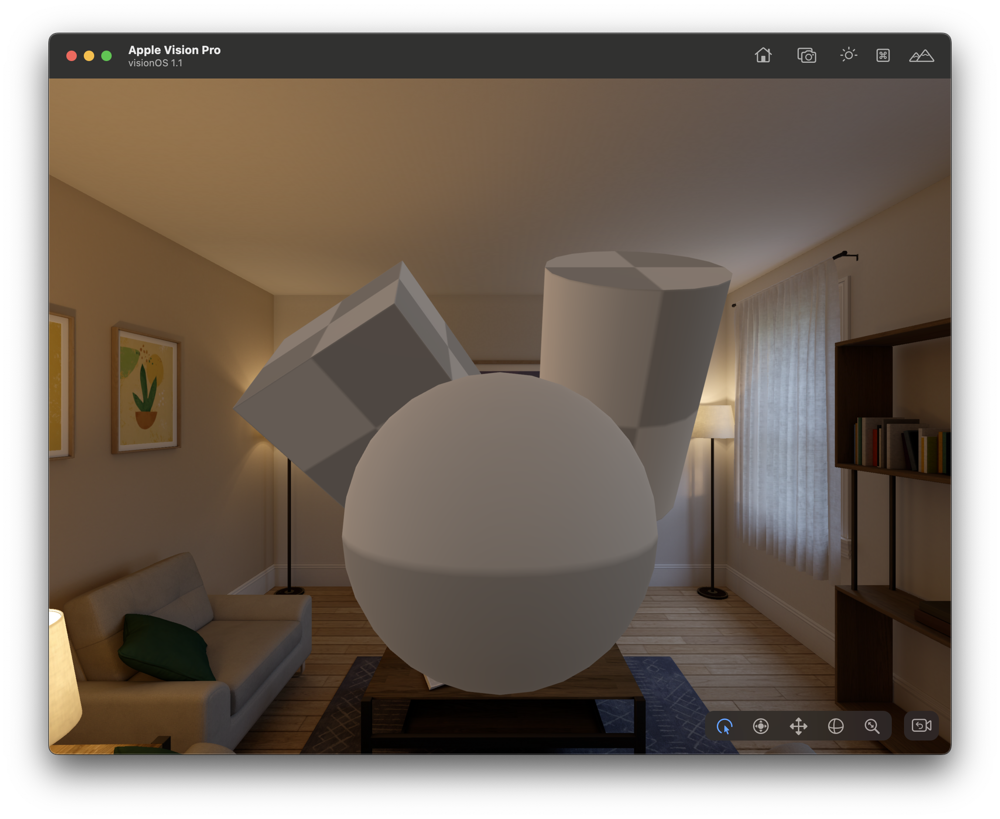
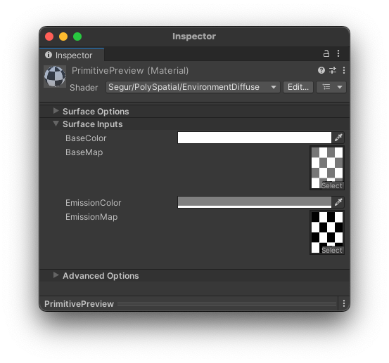
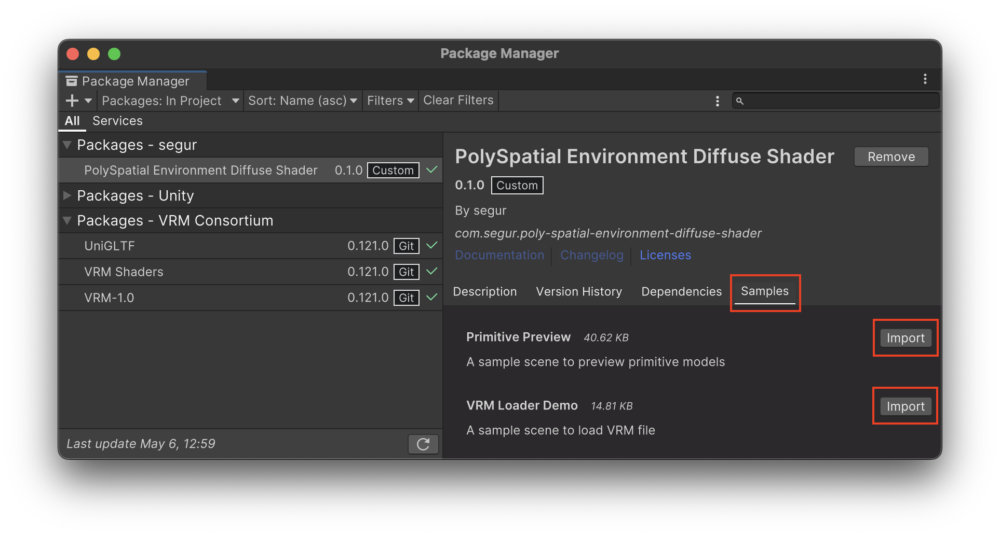
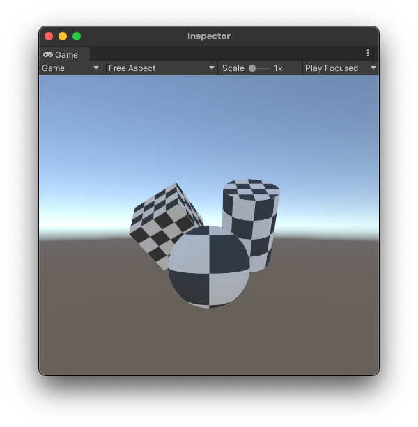
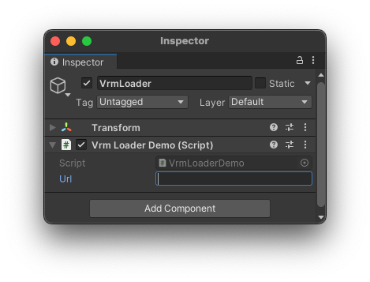

# PolySpatial Environment Diffuse Shader

| Bright environment | Dark environment |
|---|---|
|  |  |

# What is this shader?

This shader reflects the diffuse light of the environment, captured by the external cameras of Apple Vision Pro, onto the surface.

The above images were captured using the visionOS Simulator, where we prepared a bright room and a dark room. The same material is applied to the central objects, but you can see that the surface brightness changes depending on the brightness of the room.

Internally, this shader uses the `PolySpatial EnvironmentRadiance` node of Shader Graph.

# Requirements

- Unity 2022.3.18 or later
- visionOS Build Support
- Universal Render Pipeline URP
- PolySpatial 1.1.6 or later

# How to use

- Create or Select a material.
- In the `Shader` field, choose `Segur/PolySpatial/EnvironmentDiffuse`.
- Set the base color in `BaseColor`.
- Assign a texture to `BaseMap`.
- Set the `EmissionColor` and `EmissionMap` as needed.

# VRM Support

This shader is compatible with VRM 1.0. By specifying `EnvironmentDiffuseMaterialDescriptorGenerator` as the `MaterialDescriptorGenerator` when loading a VRM file, this shader will be applied. For more details, please refer to the sample scene.

# Samples

Here are some sample scenes.

## Primitive Preview

This is a sample scene where this shader is simply applied to a sphere, a cube, and a cylinder.

## VRM Loader Demo

This is a sample scene that loads a VRM file.

- Install following packages:
  - `com.vrmc.gltf`
  - `com.vrmc.vrm`
  - `com.vrmc.vrmshaders`
- Specify the URL of your preferred VRM file in the `Url` field of the `VrmLoader` within the scene.
- Run the scene, then the VRM will be displayed with this shader applied.

